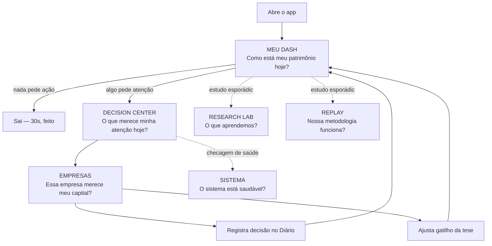

# ENCORPEI INVEST — PRODUCT ARCHITECTURE

**Bloco 2 · Sprint 2.0 — Product Layer, UX Architecture**
**04/08/2026 · v1**

> Este documento define COMO o Encorpei se comporta como produto, a partir de agora. O Foundation (Bloco 1 + v3.1 + v4) está encerrado como frente de trabalho de domínio — nenhuma regra de negócio, motor ou cálculo novo nasce aqui. Tudo que este documento descreve consome o que o Foundation já calcula.

---

## Nota de processo (por que este documento chega depois do Meu Dash, não antes)

A ordem original pedida foi: arquitetura primeiro, Sprint 2.1 (Meu Dash) só depois de aprovada. Na prática, a Sprint 2.1 já tinha sido implementada e publicada (commit `233c038`) quando este brief chegou — decisão registrada com você: em vez de desfazer o que já está no ar, este documento **documenta o Meu Dash real como Tela 1** e define as 5 telas restantes, a navegação e o design system a partir daqui pra frente. Onde o Meu Dash construído diverge do que uma arquitetura ideal pediria, isso está marcado explicitamente na seção da Tela 1 — não escondido.

---

## 1. Filosofia do produto

O Encorpei existe para responder, em menos de 30 segundos, três perguntas que todo investidor pessoal deveria conseguir responder sobre a própria carteira e nunca consegue de cabeça: *como estou indo, o que precisa da minha atenção agora, e essa empresa específica ainda merece meu capital.* Tudo mais no produto é infraestrutura a serviço dessas três perguntas.

Três princípios não-negociáveis guiam toda decisão de produto daqui pra frente:

**Regras decidem, o produto explica.** Nenhuma tela, nenhum componente, nenhum texto gerado nasce de um cálculo no frontend ou de um palpite de um modelo de linguagem. Todo número, toda classificação, toda frase contextualizada vem de uma função pura do Foundation, já testada, já versionada. O produto é a camada de tradução — pega o que o motor decidiu e mostra de um jeito que um investidor pessoal, sem MBA em finanças, entende em segundos.

**Contexto é obrigatório, nunca opcional.** Um número sem comparação é ruído. "Carry: 11,8%" não significa nada sozinho; "Carry IPCA+11,8%, acima da média do setor hoje" significa. Essa regra (já em produção no Meu Dash desde a Sprint 2.1, via `dash-narrativa.ts`) se generaliza para as 5 telas seguintes: todo indicador mostrado carrega, ao lado ou em tooltip, o que ele significa em relação a alguma referência.

**Honestidade sobre confiança.** Onde o Foundation não tem motor real (Growth Médio, probabilidade estatística de atingir uma meta, Macro além de Selic), o produto mostra "—" com o motivo — nunca um número decorativo. Onde dois motores concorrentes ainda coexistem (Confluence v1 vs. v2, por exemplo), o produto rotula qual versão está mostrando e por quê, em vez de esconder a divergência.

## 2. Jornada do usuário

Carlos é o único usuário do sistema hoje. A jornada dele tem três modos de uso, não um fluxo linear único:

- **Checagem rápida (diária, ~30s):** abre o Meu Dash, olha o Hero Executivo e a Barra Superior, confirma que nada pede ação. Sai. Este é o modo mais frequente e o que dita a densidade/hierarquia do Meu Dash.
- **Investigação dirigida (quando algo pede atenção):** um alerta crítico ou importante aparece → vai para o Decision Center para entender o que mudou e por quê → de lá, entra em Empresas para reler a tese e a evidência da empresa específica → registra uma decisão (Diário) ou ajusta um gatilho.
- **Estudo/aprendizado (esporádico, sem gatilho de urgência):** entra direto em Research Lab pra ver o que o sistema aprendeu sobre os próprios palpites, ou em Replay pra conferir se a metodologia realmente bateu com o resultado real ao longo do tempo.



## 3. Estrutura de navegação

### Navegação atual (antes deste documento)

O menu lateral (`src/components/Shell.tsx`) tem 4 grupos e 14 itens hoje: Patrimônio (Meu Dash, Minha Carteira), Decidir (Radar, Compounders, Técnico, Teses, Ranking, Comparar), Registrar (Diário, Replay, Time Machine), Transparência (Algoritmo, Auditoria) — mais 4 itens "Em construção" (Watchlist, Backtests, IA explicativa, Laboratório). "Saúde da Carteira" já não tem entrada própria (redireciona pra `/carteira`) — essa parte da consolidação pedida já tinha acontecido antes deste brief.

### Navegação-alvo (definida agora, implementação é trabalho de sprint futuro)

| # | Item de menu | Rota-alvo | Consolida |
|---|---|---|---|
| 1 | **Meu Dash** | `/` | Meu Dash atual + Minha Carteira (`/carteira`) totalmente incorporada — sem entrada própria de menu |
| 2 | **Decision Center** | `/decisoes` (nova) | Radar, parte de Ranking, Timeline/Alertas hoje espalhados no Meu Dash |
| 3 | **Empresas** | `/empresas` (nova, substitui `/tese/[ticker]` como hub) | Tese, Comparar, Compounders/[ticker], Técnico/[ticker], Auditoria/carry/[ticker] |
| 4 | **Research Lab** | `/research-lab` (nova) | Nada hoje — primeira UI real do ERL (schema já existe, migração 019) |
| 5 | **Replay** | `/replay` | Replay + Time Machine mesclados (mesma pergunta: "o que já aconteceu e o que o sistema já sabia") |
| 6 | **Sistema** | `/sistema` (nova) | Algoritmo, Auditoria (visão de saúde do sistema, não de uma empresa) |

**Regra de eliminação, aplicada com uma ressalva registrada:** "Meu Patrimônio", "Carteira" e "Saúde da Carteira" deixam de existir como **itens de menu** — todos os três já viraram (Carteira: nesta sprint) ou vão virar seções dentro do Meu Dash. Isso não significa que a rota `/carteira` desaparece: hoje ela ainda é necessária como tela de *edição* de posições (adicionar/editar/excluir, via server action com checagem de usuário) — o Meu Dash linka para ela ("carteira completa →"), mas ela deixa de estar no menu lateral. Rotas de escrita continuam existindo fora do menu principal; só telas de leitura pura são plenamente absorvidas.

**Ranking, Teses, Diário e Algoritmo/Auditoria** não estão na lista de 6 e precisam de uma decisão de produto (não técnica) sobre onde entram: Ranking e Teses são candidatos naturais a ficarem *dentro* de Empresas (uma é a lista, a outra é o hub por empresa); Diário provavelmente vira uma ação disponível dentro de Empresas e Decision Center, não uma tela própria; Algoritmo/Auditoria alimentam Sistema. Proposta registrada na seção 13 (Roadmap), decisão final é sua antes de qualquer implementação.

## 4. Hierarquia das telas

```
Meu Dash (centro, ponto de entrada único)
  ├─ 1 clique → Decision Center (quando algo pede atenção)
  ├─ 1 clique → Empresas (por ticker, de qualquer lista/card)
  └─ link → Minha Carteira (edição, fora do menu)

Decision Center
  └─ 1 clique → Empresas (aprofundar numa decisão específica)

Empresas
  ├─ ação → Diário (registrar decisão)
  └─ ação → ajustar gatilho da tese

Research Lab (paralelo, sem dependência de fluxo)
Replay (paralelo, sem dependência de fluxo)
Sistema (paralelo, consultado por curiosidade/auditoria, não por rotina)
```

Meu Dash é a raiz de tudo — nenhuma outra tela tem lógica própria de "primeira tela do dia". Decision Center e Empresas formam o par investigação→ação. Research Lab, Replay e Sistema são consultados sob demanda, nunca por rotina — por isso ficam mais afastados na hierarquia visual (menu, não centro de tela).

## 5. As 6 telas

### TELA 1 — MEU DASH

**Pergunta principal:** Como está meu patrimônio hoje?
**Persona:** Carlos, checagem rápida diária, decisão em segundos.
**Status:** ✅ implementada (Sprint 2.1, commit `233c038`) — esta seção documenta o que existe de fato, com divergências da arquitetura ideal marcadas.

**Objetivo.** Responder a pergunta principal sem exigir nenhum clique — tudo que importa cabe na primeira dobra em telas largas (desktop-first). Nenhum cálculo acontece aqui; toda métrica vem de um motor.

**Fluxo do usuário.** Abre `/` → lê Hero Executivo (patrimônio + uma frase contextualizada da maior posição) → escaneia a Barra Superior de 10 números → se algo estiver colorido de âmbar/vermelho, desce até Alertas ou Minha Carteira → se nada pedir atenção, fecha em segundos.

**Fluxo dos dados.** Server Component (`src/app/page.tsx`) busca dado bruto do Supabase (posições, preços, teses, eventos) e chama os motores/adaptadores do Foundation (`decision-dados.ts` → Master Engine/Decision Object; `portfolio-fit-dados.ts`; `thesis-status-dados.ts`; `dash-agregados.ts`; `alertas.ts`; `dash-narrativa.ts`) e os motores pré-Foundation ainda em uso (`radar.ts`, `patrimonio-dados.ts`, `decision-feed.ts`). Nenhuma conta acontece em componente cliente.

**Componentes.** `Shell`, `MiniStat` (Barra Superior), `Bloco` (painel genérico), `StatMini`, `MiniNum`, `GraficoPatrimonio` (client component, único com estado local — seleção de período), `Sparkline`, `SetaComparacao` (▲/▼/≈ setorial).

**Prioridade visual (topo → base):** Hero Executivo → Barra Superior (10 cards) → Performance + Resumo IA/Alertas/Radar/Oportunidades → Minha Carteira + Saúde da Carteira → Timeline/Decision Feed/Macro/Heatmap → Universo por nota (abaixo da dobra, com rolagem).

**Estados.**
- *Loading:* Server Component — não há skeleton hoje, o Next.js suspende a rota inteira até os dados chegarem (gap de UX registrado na seção 12).
- *Erro/Supabase não configurado:* mensagem única "Supabase não configurado", sem quebrar a tela.
- *Sem dados (sem posições registradas):* cada bloco mostra sua própria mensagem de corte honesto ("Registre posições em /carteira para..."), nunca um card vazio sem explicação.
- *Sucesso:* estado completo descrito acima.

**Ações disponíveis.** Nenhuma ação de escrita nesta tela (decisão deliberada — edição de posição só existe em `/carteira`, pra não duplicar a checagem de usuário/admin). Só navegação (links pra `/carteira`, `/tese/[ticker]`, `/radar`, `/replay`, `/diario`, `/ranking`).

**Critérios de aceitação.**
1. Todo número tem uma variável calculada por trás — nunca um valor decorativo (ver `page.tsx`, comentário de topo).
2. Nenhum cálculo no cliente — `GraficoPatrimonio` é o único client component e só faz filtro/interpolação de exibição sobre pontos já calculados, nunca soma/pondera de novo.
3. Onde falta motor ou dado, "—" com o motivo, sempre.
4. Carrega sem erro com zero posições registradas (estado vazio tratado em todo bloco).

**Integração com Foundation (Decision Object, Opção A).** Único ponto do produto hoje que consome Master Engine/Confluence v2/Carry v2 (escada)/Portfolio Fit/Thesis Engine. **Divergência registrada e não escondida:** Carry e Confluence mostrados aqui podem ser numericamente diferentes do que `/carteira`, `/radar` e `/ranking` mostram pro mesmo ticker (essas telas continuam em v1/Confluence de 4 componentes) até uma sprint futura migrar todas as telas pra mesma fonte. Growth Médio mostra "—" (`Decision.growth` sem motor real).

**Divergências da arquitetura ideal, registradas por transparência:**
- Estados de Loading/Erro não seguem um padrão visual único ainda (cada bloco resolve à sua maneira) — o Design System (seção 8) formaliza isso pra frente, Meu Dash não foi retrofitado.
- "Minha Carteira" ainda tem uma rota própria fora do menu (`/carteira`) para edição — não é 100% "incorporada", é "linkada a partir de".
- Radar/Oportunidades/Timeline/Decision Feed nesta tela deveriam, na arquitetura-alvo, provavelmente migrar pro Decision Center (Tela 2) — hoje ainda vivem no Meu Dash porque o Decision Center não existe como rota própria. Ver Roadmap (seção 13).

---

### TELA 2 — DECISION CENTER

**Pergunta principal:** O que merece minha atenção hoje?
**Persona:** Carlos, quando o Meu Dash sinalizou algo (âmbar/vermelho) ou quando quer revisar tudo que está pendente de decisão.
**Status:** 🔲 não implementada — rota `/decisoes` não existe ainda.

**Regra de ouro desta tela, do próprio brief:** nunca listar indicadores, sempre listar decisões. Isso significa: não é uma segunda cópia da Barra Superior do Meu Dash. Cada linha desta tela é uma DECISÃO em aberto — "revisar tese de X", "gatilho crítico disparou em Y", "candidata forte que ainda não tem tese" — nunca um número solto.

**Objetivo.** Consolidar todo sinal que hoje está espalhado (Radar, Alertas do Meu Dash, Timeline, `em_revisao`) numa lista única, ordenada por severidade real (reaproveita `alertas.ts`, já existe), cada item com uma ação clara de próximo passo.

**Fluxo do usuário.** Chega vindo do Meu Dash (clicou num alerta crítico) ou entra direto pelo menu → vê a lista ordenada por severidade → clica num item → vai pra Empresas com o contexto da decisão já carregado (não repete a investigação do zero).

**Fluxo dos dados.** Mesmo `alertas.ts` (classificação de severidade) e `decision-dados.ts` (FDIE/Thesis Status) que o Meu Dash já usa — nenhum motor novo. A diferença é de apresentação: o Meu Dash mostra um resumo de 3 itens dentro de um card pequeno; o Decision Center é a tela cheia, com todos os itens, filtráveis por severidade/tipo.

**Componentes.** Lista de decisões (novo componente, reaproveitando o padrão visual de `Bloco`), chip de severidade (`COR_SEVERIDADE`, já existe em `alertas.ts`/`page.tsx`), filtro por severidade/tipo (novo).

**Prioridade visual.** Crítico sempre no topo, sem exceção (mesma regra de `ordenarPorSeveridade`). Um resumo de contagem (Crítico/Importante/Informativo) no topo da tela, lista abaixo.

**Estados.** Loading (skeleton da lista); Erro (Supabase indisponível); Sem dados (nenhuma decisão pendente — estado de sucesso raro e bom, mensagem tipo "Nada pede sua atenção hoje", nunca uma lista vazia sem explicação); Sucesso (lista populada).

**Ações disponíveis.** Ir para Empresas com contexto; marcar como "revisado" (precisa de decisão de produto — hoje não existe conceito de "alerta lido" no banco, seria um dado novo, não um motor novo — registrar como pendência técnica pequena, fora do escopo de "nenhum motor novo").

**Critérios de aceitação.**
1. Toda linha da lista é uma decisão, nunca um indicador solto.
2. Ordenação por severidade é sempre a mesma régua de `alertas.ts` — nenhuma reordenação visual "estética" que desrespeite severidade.
3. Zero decisões pendentes é um estado tratado explicitamente, não uma tela vazia.

**Integração com Foundation.** `alertas.ts`, `decision-dados.ts` (FDIE, Confluence v2 pra contexto), `thesis-status-dados.ts` (Thesis Status), `radar.ts` (candidatas ainda sem tese).

---

### TELA 3 — EMPRESAS

**Pergunta principal:** Essa empresa merece meu capital?
**Persona:** Carlos, aprofundando numa empresa específica — either porque uma decisão pediu, either por curiosidade/estudo.
**Status:** 🔲 não implementada como hub único — hoje espalhada em `/tese/[ticker]`, `/comparar`, `/compounders/[ticker]`, `/tecnico/[ticker]`, `/auditoria/carry/[ticker]`.

**Objetivo.** Um lugar só por empresa, respondendo a pergunta com todas as lentes que o Foundation já calcula: tese (Thesis Engine), Confluence/Carry (Decision Object), Compounder, Técnico, Portfolio Fit (se já é posição), FDIE/Auditoria. Hoje essas 5 telas obrigam Carlos a montar o quadro na cabeça, navegando entre abas — a Tela 3 monta o quadro por ele.

**Fluxo do usuário.** Busca por ticker (busca global já existe, `/buscar`) ou chega de um link (Meu Dash, Decision Center, Ranking) → vê a Decision Object inteira daquela empresa numa tela só → decide se registra uma decisão no Diário ou ajusta um gatilho.

**Fluxo dos dados.** `decision-dados.ts` (já existe, hoje só chamado em lote pro Meu Dash — precisa de uma variante ou reaproveitamento pra ticker único), `thesis-engine.ts` via `thesis-status-dados.ts`, `compounder-dados.ts`, `technical-dados.ts`, `portfolio-fit-dados.ts` (se for posição existente), `auditoria.ts`/`proveniencia.ts` (FDIE).

**Componentes.** Cabeçalho da empresa (ticker, nome, setor, modelo de negócio), abas ou seções por lente (Tese / Decision / Compounder / Técnico / Auditoria), gráfico de preço (reaproveita padrão do `GraficoPatrimonio`, escala diferente), linha do tempo da tese (reaproveita Timeline do Meu Dash).

**Prioridade visual.** Tese e Decision Object primeiro (é a pergunta central); Compounder/Técnico/Auditoria como aprofundamento, abaixo ou em abas secundárias.

**Estados.** Loading; Erro; Sem tese ainda (empresa do universo de 40 sem tese escrita — estado comum, precisa de CTA claro "escrever tese"); Sucesso.

**Ações disponíveis.** Registrar decisão (Diário), editar/ratificar tese, ajustar gatilho.

**Critérios de aceitação.**
1. Toda métrica mostrada linka de volta pro motor que a produziu (rastreabilidade).
2. Empresa sem tese não quebra a tela — mostra o que tem (Radar, Compounder, Técnico) e convida a escrever a tese.
3. Nenhuma nota aparece sem justificativa (regra de UX #7, ver seção 9).

**Integração com Foundation.** É a tela que mais motores toca: Master Engine, Confluence v2, Carry (escada), Thesis Engine, Cause & Effect, Thesis Strength, Compounder, Technical, Portfolio Fit, FDIE/Proveniência, Evidence.

---

### TELA 4 — RESEARCH LAB

**Pergunta principal:** O que aprendemos?
**Persona:** Carlos, em modo estudo — sem urgência, quer entender se os próprios palpites/hipóteses estão se confirmando.
**Status:** 🔲 não implementada — nenhuma UI existe. O schema (migração 019, `erl.hipoteses`/`erl.aprovacoes`) e os motores (`evidence-weight.ts`, `predictive-factor-registry.ts`, `decision-dna.ts`, `research-case.ts`) já existem, mas nenhum tem tela.

**Objetivo.** Mostrar, por fator preditivo (ROIC, margem, Carry, timing técnico, etc.), a taxa de acerto histórica real (`decision-dna.ts`) e o status de cada hipótese em teste no ERL (ativa/experimental/descartada, `predictive-factor-registry.ts`) — nunca ajustar peso nenhum automaticamente, só mostrar o que já foi aprovado manualmente (`evidence-weight.ts` só lê `erl.aprovacoes`, nunca decide sozinho).

**Fluxo do usuário.** Entra por curiosidade → vê a lista de fatores e taxa de acerto → identifica um fator "descartado" ou "experimental" e entende por quê → eventualmente aprova/reprova uma hipótese (ação de escrita em `erl.aprovacoes`, fora do escopo desta sprint de arquitetura, mas a tela precisa expor o dado pra essa decisão ser possível).

**Componentes.** Tabela/cards de fatores com taxa de acerto, badge de status (ativo/experimental/descartado), detalhe do caso histórico (`research-case.ts`).

**Estados.** Loading; Erro; Sem dado suficiente (fator com poucas observações — `MIN_OBS_FATOR` já define o mínimo em `decision-dna.ts`, a tela precisa respeitar o mesmo corte, nunca mostrar taxa de acerto com amostra insuficiente); Sucesso.

**Ações disponíveis.** Nenhuma ação de escrita definida ainda — pendência de produto, não técnica (decidir se aprovar/reprovar hipótese acontece nesta tela ou fica fora do Product Layer por enquanto).

**Critérios de aceitação.**
1. Nenhuma taxa de acerto aparece abaixo do mínimo de amostra (`MIN_OBS_FATOR`).
2. Status "descartado" sempre vem com o motivo, nunca só o rótulo.

**Integração com Foundation.** `decision-dna.ts`, `decision-history.ts`, `evidence-weight.ts`, `predictive-factor-registry.ts`, `research-case.ts`, `evidence.ts`.

---

### TELA 5 — REPLAY

**Pergunta principal:** Nossa metodologia realmente funciona?
**Persona:** Carlos, auditando o sistema contra a realidade — "se eu tivesse seguido a régua sempre, teria dado certo?"
**Status:** 🟡 parcialmente implementada — `/replay` e `/timemachine` existem como telas separadas hoje; a arquitetura-alvo pede as duas mescladas numa só (mesma pergunta, ângulos diferentes: Replay = timeline de eventos passados; Time Machine = "o que o sistema sabia numa data X").

**Objetivo.** Timeline de tudo que já aconteceu (gatilhos, mudanças de status, decisões) cruzada com o resultado real de preço depois (`probability-engine-v2.ts`, backtest de preço vs. CDI/Ibovespa) — sem cherry-picking, mostrando acerto E erro.

**Fluxo do usuário.** Entra pra auditar um período específico ou pra reconstruir "o que eu sabia no dia X" antes de uma decisão → navega pela timeline → eventualmente volta pra Empresas pra reler o contexto completo de um evento específico.

**Componentes.** Timeline vertical (já existe no Meu Dash, reaproveitável), seletor de data (Time Machine), resultado de probabilidade v2 por janela (12/24/36/60 meses).

**Estados.** Loading; Erro; Sem eventos no período (comum em período curto); Sucesso.

**Ações disponíveis.** Nenhuma ação de escrita — tela de leitura/auditoria pura.

**Critérios de aceitação.**
1. Nunca mostra só os acertos — taxa de acerto e erro juntos, sempre.
2. Reconstrução "o que o sistema sabia em X" usa só dado que existia até aquela data (sem vazamento de informação futura) — já é a promessa do Time Machine atual, precisa ser preservada na fusão.

**Integração com Foundation.** `decision-timeline.ts`, `decision-history.ts`, `probability-engine.ts`, `probability-engine-v2.ts`, `decision-journal.ts`.

---

### TELA 6 — SISTEMA

**Pergunta principal:** O sistema está saudável?
**Persona:** Carlos, checando a própria infraestrutura — não uma pergunta de investimento, é uma pergunta de confiança na ferramenta.
**Status:** 🟡 parcialmente implementada — `/algoritmo` (explica a metodologia) e `/auditoria` (FDIE) já existem como telas separadas; consolidação numa só tela "Sistema" ainda não feita.

**Objetivo.** Mostrar versão do algoritmo em uso (v1/v2, por ticker), inventário de motores ativos (o mapa da seção 11 deste documento, em forma de tela), logs de execução dos crons, e o estado do FDIE (quantas verificações críticas/alerta/ok existem hoje no universo).

**Componentes.** Lista de motores com status (ativo/sem call site — reaproveitando o inventário desta arquitetura), painel de execução dos crons (RODA SOZINHO, já documentado em texto no roadmap, nunca em tela), resumo FDIE agregado.

**Estados.** Loading; Erro; Sucesso (não há "sem dados" relevante — o sistema sempre tem alguma versão/log pra mostrar).

**Ações disponíveis.** Nenhuma ação de escrita — tela de leitura/transparência pura.

**Critérios de aceitação.**
1. Toda informação de "saúde" vem de dado real coletado (execução de cron, resultado de FDIE) — nunca um indicador de status decorativo tipo "tudo ok" sem verificação por trás.

**Integração com Foundation.** `auditoria.ts` (FDIE v1), `proveniencia.ts` (FDIE v2), inventário estático de motores (este documento + `score-setorial.ts`'s `versao_algoritmo`).

## 6. Lista de componentes (cross-screen)

Componentes que já existem e devem ser reaproveitados (não recriados) nas próximas 5 telas:

| Componente | Onde vive hoje | Reaproveitável em |
|---|---|---|
| `Shell` | `src/components/Shell.tsx` | Todas as telas (navegação já é compartilhada) |
| `Bloco` | `src/app/page.tsx` (local) | Todas — candidato a virar `src/components/Bloco.tsx` compartilhado |
| `MiniStat` / `StatMini` / `MiniNum` | `src/app/page.tsx` (local) | Sistema (métricas de saúde), Research Lab (taxa de acerto) |
| `Sparkline` | `src/components/Sparkline.tsx` | Empresas, Decision Center |
| `GraficoPatrimonio` | `src/components/GraficoPatrimonio.tsx` | Empresas (gráfico de preço, adaptar), Replay |
| `SetaComparacao` | `src/app/page.tsx` (local) | Empresas (qualquer indicador com comparação setorial) |
| Chip de severidade (`COR_SEVERIDADE`) | `src/app/page.tsx` (local) | Decision Center (é a tela que mais usa) |
| Chip de status derivado (`COR_STATUS_DERIVADO`) | `src/app/page.tsx` (local) | Empresas, Decision Center |
| Timeline vertical | `src/app/page.tsx` (local, bloco "Timeline") | Replay (é praticamente a tela inteira lá) |
| Heatmap de retorno | `src/lib/heatmap.ts` + local em `page.tsx` | Empresas (se quiser heatmap setorial) |

**Regra de refatoração implícita:** vários componentes acima estão hoje definidos localmente dentro de `page.tsx` porque só o Meu Dash os usava. Assim que uma segunda tela precisar do mesmo componente, ele deve subir pra `src/components/` — nunca duplicado por copiar/colar. Isso é trabalho de implementação, não desta sprint de arquitetura, mas fica registrado como regra pra quem for construir a Sprint 2.2.

## 7. Design System

Documentando o que já está em produção no Meu Dash (não inventando um sistema novo) e formalizando pra ser seguido nas 5 telas seguintes.

**Grid.** Desktop-first, densidade alta. Barra superior: `grid-cols-2` (mobile) → `sm:grid-cols-5` → `xl:grid-cols-10`. Painéis: `grid-cols-1` (mobile) → `xl:grid-cols-N` conforme proporção da seção (ex.: gráfico 70%/sidebar 30% vira `xl:col-span-7`/`xl:col-span-3` numa grade de 10).

**Espaçamentos.** Gap padrão entre blocos: `gap-2` (compacto, Barra Superior) a `gap-3` (painéis maiores). Padding interno de painel: `p-3.5`. Sem espaçamento solto — a densidade é intencional, não um bug a corrigir.

**Tipografia.** Números sempre `font-mono` (alinhamento visual em tabela/coluna). Rótulos: `text-[8px]` a `text-[11px]`, `uppercase`, `tracking-wider`/`tracking-[0.22em]`, cor `text-slate-400`/`text-slate-500`/`text-slate-600` (hierarquia por opacidade, não por tamanho). Valores: `text-[13px]` a `text-[16px]` `font-bold`, exceto Hero Executivo (`text-[32px]`).

**Cores (Dark Theme, único implementado hoje).** Fundo base `#07111e` com gradiente radial sutil (verde/azul a ~5% de opacidade). Painéis: `bg-white/[0.03]` com borda `border-white/[0.06]`. Semântica de cor, sempre com significado, nunca decorativa: verde (`emerald`) = positivo/alta convicção; vermelho (`red`) = negativo/crítico; âmbar (`amber`) = atenção/importante; azul (`sky`) = interação/link/neutro-informativo; cinza (`slate`) = neutro/indisponível.

**Ícones.** Nenhuma biblioteca de ícones em uso hoje — o sistema usa símbolos tipográficos (▲/▼/≈, •) e cor/texto no lugar de ícones. Decisão de produto pendente: manter esse estilo minimalista (reforça "regras decidem, nunca capricho visual") ou introduzir uma biblioteca (ex. lucide-react) nas telas novas — registrado como pergunta aberta na seção 12.

**Cards.** `rounded-[16px]` (painel) / `rounded-[10px]` (stat card compacto) / `rounded-full` (chip/badge). Sempre `border` + `bg-white/[0.0X]`, nunca sombra dura — profundidade vem de opacidade de borda/fundo, não de `box-shadow`.

**Tabelas.** Cabeçalho `text-[9-10px] uppercase tracking-wider text-slate-600`, linhas `border-t border-white/5`, hover `hover:bg-white/[0.03]`. Números sempre alinhados à direita (`text-right font-mono`).

**Gráficos.** SVG puro, sem biblioteca de charting (decisão deliberada, ver comentário em `GraficoPatrimonio.tsx`) — controle total sobre honestidade visual (ex.: reancoragem de série por período, nunca escala enganosa).

**Hover / Animações / Transições.** `transition-colors` em links e linhas de tabela. Uma única animação de entrada (`gp-linha`, desenho progressivo das linhas do gráfico via `stroke-dashoffset`, ~1.15s `cubic-bezier`) — sem excesso de movimento em nenhum outro lugar do produto.

**Glass.** O "glass" do produto é opacidade de fundo (`bg-white/[0.02]` a `[0.05]`) sobre o fundo radial, sem `backdrop-blur` na maioria dos painéis — exceção: tooltip do gráfico usa `backdrop-blur` (`bg-[#0b1a2a]/95 backdrop-blur`), porque paira sobre a própria linha do gráfico e precisa de contraste extra.

**Bordas / Sombras.** Bordas finas (`border` = 1px) em opacidade baixa (`white/[0.05]` a `[0.10]`) fazem todo o trabalho de separação visual — o produto não usa `box-shadow` em lugar nenhum hoje.

**Light Theme.** **Não implementado.** Existe só o boilerplate padrão do Next.js (`@media (prefers-color-scheme: dark)` em `globals.css`, sem paleta clara real por trás). Corte honesto: este documento NÃO inventa uma paleta clara agora — fica registrado como trabalho futuro explícito (ver Roadmap), não como "preparado".

## 8. UX Principles

As 7 regras do brief, mantidas verbatim como princípio, com a nota de onde cada uma já está em produção:

1. **Toda tela responde apenas uma pergunta principal.** Já é verdade nas 6 telas definidas acima — cada uma tem exatamente uma pergunta na seção 5.
2. **Mostrar apenas informação útil para responder essa pergunta.** Testado no Meu Dash pela primeira vez nesta sprint (ex.: tabela de Minha Carteira resumida deliberadamente sem botões de editar/excluir, que pertencem a outra pergunta).
3. **Toda informação deve ter contexto.** Em produção via `dash-narrativa.ts` (Meu Dash); generaliza pras 5 telas seguintes.
4. **Toda decisão deve ter explicação.** Já é o papel de `decision-explanation.ts` (Foundation) — falta wiring numa tela além do Decision Object bruto.
5. **Toda recomendação deve ter evidência.** `evidence.ts` já existe; nenhuma tela ainda expõe evidência lado a lado com a "recomendação" (que, pela regra 7/CLAUDE.md, nunca é uma recomendação de compra/venda — é força de tese).
6. **Toda probabilidade deve ter metodologia.** `probability-engine.ts`/`v2.ts` já documentam o método no próprio resultado (`ResultadoProbabilidade`) — nenhuma tela ainda mostra esse texto metodológico junto do número.
7. **Nenhuma nota deve aparecer sem justificativa.** Regra mais antiga do projeto (já valia desde o Score v1) — continua valendo, generalizada agora pra Confluence, Carry, Portfolio Fit e Thesis Score também.

## 9. Product Rules

Também mantidas verbatim, como regras de bloqueio (não são aspiração, são o que trava merge/deploy):

- Nenhum componente pode calcular.
- Nenhuma tela pode criar regra de negócio.
- Nenhuma decisão pode nascer no frontend.
- Todo dado vem do Foundation.

Estas 4 regras já valiam implicitamente desde o Bloco 1 (CLAUDE.md, regra 6: "Regras decidem, IA explica") — este documento as torna explícitas também pro Product Layer, não só pro backend.

## 10. Mapa de consumo do Foundation

Inventário completo de `src/lib/` (levantado nesta sprint) mapeado às 6 telas. "Consumido hoje" reflete o estado real do código, não a intenção.

| Motor / arquivo | Grupo | Consumido hoje por | Telas-alvo (arquitetura) |
|---|---|---|---|
| `score.ts`, `score-setorial.ts`, `setores.ts` | Score oficial | `/api/teses/avaliar` (cron), `/radar`, `/ranking` | Empresas, Sistema |
| `carry/*` (types, v1-piso, v2-growth, v3-cash, index, escada, leitura) | Carry Engine | `radar.ts` (Carry v1), `decision-dados.ts` (Carry v2/escada, só Meu Dash) | Meu Dash ✅, Empresas |
| `confluencia.ts` (v1 e v2) | Confluence | `confluencia-dados.ts` (v1, `/carteira`), `master-engine.ts` (v2, só Meu Dash) | Meu Dash ✅, Empresas, Decision Center |
| `master-engine.ts`, `decision-object.ts`, `decision-explanation.ts`, `evidence.ts`, `probability-engine.ts`, `probability-engine-v2.ts`, `estimativa.ts`, `proveniencia.ts` | Master/Decision Object | `decision-dados.ts` (só Meu Dash) | Meu Dash ✅, Empresas, Decision Center, Sistema (proveniência) |
| `thesis-engine.ts`, `cause-effect.ts`, `thesis-break.ts`, `thesis-strength.ts` | Thesis | `thesis-status-dados.ts` (só Meu Dash) | Meu Dash ✅, Empresas, Decision Center |
| `portfolio-fit.ts`, `portfolio-health.ts`, `patrimonio.ts`, `heatmap.ts`, `carteira.ts` | Portfolio | Meu Dash, `/carteira` | Meu Dash ✅ |
| `capital-allocation.ts`, `wealth-engine.ts`, `forecast-engine.ts`, `scenario-engine.ts`, `opportunity-cost.ts` | Capital/Wealth/Forecast/Scenario | **Nenhuma tela** | Decision Center (capital allocation, opportunity cost), Empresas (forecast, scenario), Meu Dash (wealth, CAGR) |
| `evidence-weight.ts`, `predictive-factor-registry.ts` | Evidence Weight / ERL | **Nenhuma tela** | Research Lab |
| `technical/*`, `tecnica.ts` | Técnico | `technical-dados.ts` (Meu Dash, `/tecnico`) — nota: `tecnica.ts` (legado) precisa de auditoria pra confirmar se ainda tem consumidor real | Empresas |
| `compounder/*` | Compounder | `compounder-dados.ts` (Meu Dash, `/carteira`, `/compounders`) | Empresas |
| `auditoria.ts` (FDIE v1) | FDIE | `/auditoria` | Sistema, Empresas |
| `decision-journal.ts`, `decision-timeline.ts`, `decision-dna.ts`, `decision-history.ts` | Journal/Timeline/DNA | `decision-timeline.ts` parcialmente wired; `decision-dna.ts`/`decision-history.ts` sem tela | Replay, Research Lab |
| `radar.ts` | Radar | Meu Dash, `/radar` | Decision Center |
| `decision-feed.ts` | Decision Feed | Meu Dash | Decision Center |
| `alertas.ts`, `dash-narrativa.ts`, `dash-agregados.ts` | Sprint 2.1 (novo) | Meu Dash | Decision Center (alertas), Empresas (narrativa) |
| `mercado/provider.ts` | Infra futura | **Nenhuma tela — deliberadamente não conectado ainda** | — |

**Leitura honesta deste mapa:** 7 dos ~35 arquivos de domínio (Capital Allocation, Opportunity Cost, Wealth, Forecast, Scenario, Evidence Weight, Predictive Factor Registry) não têm NENHUM call site em produção hoje, mesmo depois da Sprint 2.1. Isso não é um problema desta arquitetura — é o estado real herdado do Foundation, e a razão de existir das Telas 2, 3 e 4 é justamente dar um lugar pra esses motores.

## 11. Critérios de aceitação (gerais, cross-cutting)

Além dos critérios específicos de cada tela (seção 5), toda tela nova precisa passar em:

1. `npx tsc --noEmit` e `npm run build` limpos antes de qualquer entrega (não só `npm run test` — lição registrada no Foundation V4, um bug de tipo só apareceu no build).
2. Nenhum novo arquivo em `src/lib/` que calcule algo que já existe em outro arquivo (checar por grep antes de escrever, disciplina mantida desde o Bloco 1).
3. Nenhuma tela nova introduz um motor novo — se a tela precisar de um cálculo que não existe, isso é sinal de que o Foundation ficou incompleto e a decisão de criar motor novo é seu, explícita, fora do escopo do Product Layer.
4. Todo estado (loading/erro/sem dados/sucesso) tratado explicitamente — nenhuma tela nova pode deixar um desses 4 estados "acontecer por acidente" (ex.: array vazio renderizando uma tabela sem cabeçalho).

## 12. Perguntas em aberto (preciso da sua decisão antes de Sprint 2.2)

- Ranking, Teses, Diário e Algoritmo/Auditoria não couberam nas 6 telas do brief — proposta na seção 3 é: Ranking/Teses dentro de Empresas, Diário como ação (não tela), Algoritmo/Auditoria dentro de Sistema. Confirma ou redesenha?
- Ícones: manter o estilo tipográfico atual (▲/▼/≈, sem lib) ou introduzir uma biblioteca de ícones nas telas novas?
- Light Theme: registrar como trabalho futuro sem prazo, ou você quer priorizar isso em algum ponto do roadmap?
- Decision Center precisa de um conceito de "alerta lido/revisado" que não existe hoje no banco (dado novo, não motor novo) — confirma que isso entra no escopo de uma sprint de implementação futura?

## 13. Roadmap do Product Layer

| Sprint | Entrega | Status |
|---|---|---|
| 2.0 | Este documento (Product Architecture) | ✅ este documento |
| 2.1 | Meu Dash consumindo o Decision Object | ✅ implementado (commit `233c038`) |
| 2.2 (proposta) | Decision Center — primeira tela nova, consolida Radar/Alertas/Timeline numa lista de decisões priorizadas | 🔲 proposto, aguardando sua aprovação |
| 2.3 (proposta) | Empresas — hub único por ticker, substitui Tese/Comparar/Compounders/Técnico/Auditoria espalhados | 🔲 proposto |
| 2.4 (proposta) | Research Lab — primeira UI do ERL, liga Evidence Weight/Predictive Factor Registry/Decision DNA a uma tela | 🔲 proposto |
| 2.5 (proposta) | Replay — fusão de Replay + Time Machine | 🔲 proposto |
| 2.6 (proposta) | Sistema — consolidação de Algoritmo + Auditoria + inventário de motores | 🔲 proposto |

Ordem sugerida segue a ordem do menu (mesma lógica do brief) e prioriza a tela que mais reduz trabalho manual do Carlos primeiro (Decision Center elimina a necessidade de montar o quadro de "o que fazer hoje" na cabeça). Você pode reordenar livremente — não há dependência técnica forte entre 2.2 e 2.3+ (cada tela consome Foundation já pronto, não uma da outra).

## 14. Plano detalhado da próxima sprint (2.2 — Decision Center)

Dado que Sprint 2.1 já está feita, esta seção substitui o item 10 do brief original ("Plano detalhado da Sprint 2.1") pelo plano da próxima sprint real de implementação.

**Objetivo da sprint:** rota `/decisoes`, tela Decision Center completa, conforme especificado na seção 5, Tela 2.

**Passo 1 — Dado.** Nenhum motor novo. Criar (ou estender `alertas.ts`) uma função que consolida: eventos de `eventos_tese` classificados por severidade (já existe), candidatas do Radar sem tese (já existe em `radar.ts`), e status de teses em revisão (`thesis-status-dados.ts`, já existe) — numa lista única de "decisões pendentes", ordenada.

**Passo 2 — Componente.** Subir `Bloco`, `COR_SEVERIDADE`, `ROTULO_SEVERIDADE` de `page.tsx` pra `src/components/` (já são reaproveitáveis, só precisam sair do escopo local). Criar o componente de lista de decisões (novo, mas simples — reaproveita o padrão visual de linha de tabela já em uso).

**Passo 3 — Tela.** `src/app/decisoes/page.tsx`, Server Component, mesmo padrão de `page.tsx` (busca dado, chama motor, desenha). Adicionar `/decisoes` ao `Shell.tsx` (grupo a definir — provavelmente reorganiza os 4 grupos atuais pros 6 itens da navegação-alvo).

**Passo 4 — Verificação.** `npx tsc --noEmit`, `npm run build`, `npm run test` limpos antes de qualquer commit — checklist definitivo desde o Foundation V4.

**Critério de pronto:** a lista de decisões do Decision Center e o resumo de Alertas do Meu Dash usam exatamente a mesma classificação de severidade (nenhuma duplicação de régua) — teste manual: um evento crítico aparece com a mesma cor/rótulo nas duas telas.

---

*Documento vivo — assim que você decidir as perguntas da seção 12 e aprovar (ou ajustar) o roadmap da seção 13, este arquivo deve ser atualizado, não substituído por um novo, mesma disciplina de versionamento do resto do projeto.*
