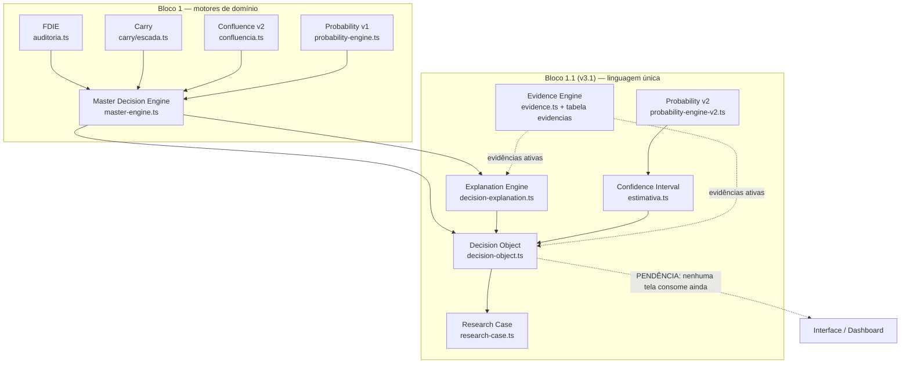
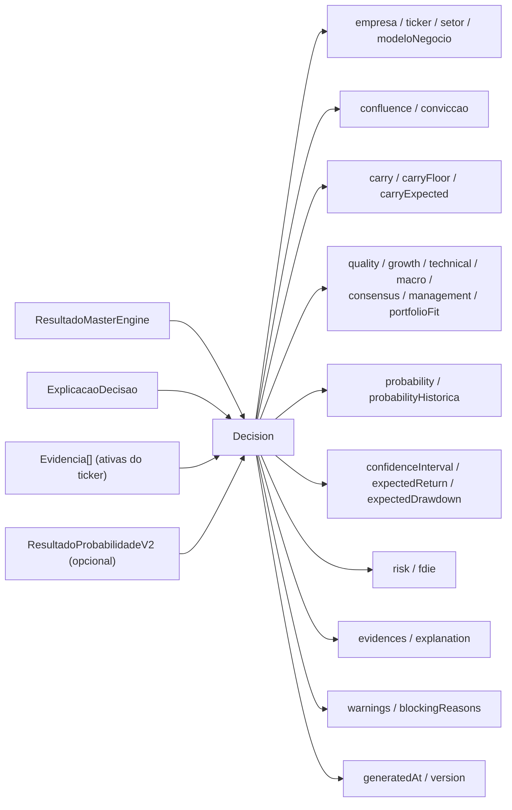
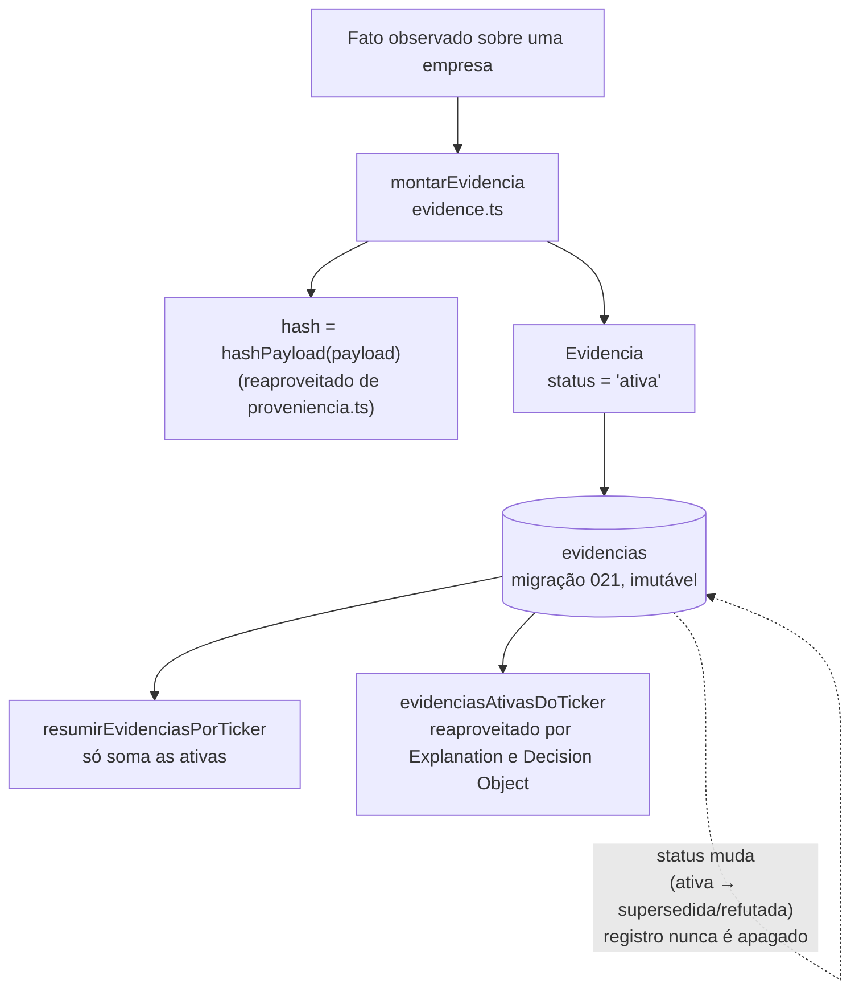
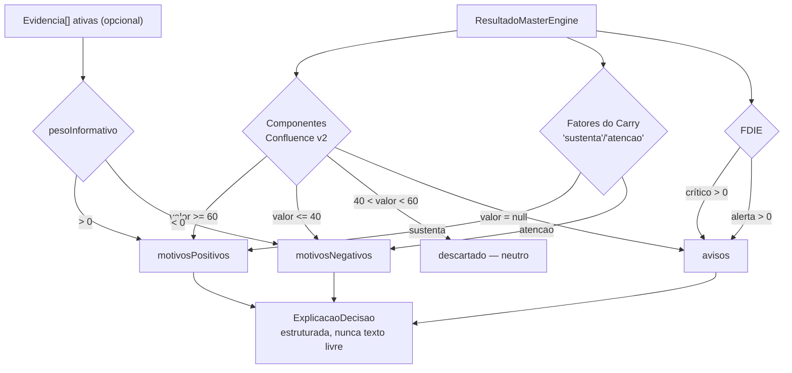

# FOUNDATION V3.1 — Consolidação da arquitetura (04/08/2026)

Sprint arquitetural, sem telas novas, sem mudança de layout/CSS/UX. Objetivo: transformar o conjunto de motores independentes do Bloco 1 (Foundation v3) em uma linguagem única de decisão — o `Decision` object — mais os motores que faltavam para ele fazer sentido (Explanation, Evidence, Probability V2, Confidence Interval) e uma auditoria formal da arquitetura.

## Auditoria da implementação anterior (antes de alterar)

Revisão de todos os arquivos do Bloco 1, seus testes e `roadmap/foundation-v3.md` antes de qualquer mudança. Achados:

- **Grafo de dependências é um DAG limpo, sem circularidade.** `master-engine.ts` depende de `auditoria.ts`, `carry/escada.ts`, `confluencia.ts`, `probability-engine.ts`; os módulos novos deste sprint (`decision-explanation.ts`, `decision-object.ts`, `research-case.ts`) se empilham em camadas acima dele, sempre numa direção. Nenhum motor de camada inferior importa um de camada superior.
- **Duplicação pré-existente identificada, não corrigida por escopo**: o padrão `"alta" | "media" | "baixa"` está declarado independentemente em ~11 arquivos (`radar.ts`, `score.ts`, `carry/types.ts`, `compounder/*`, `technical/*`, `decision-dna.ts`). Migrar os 11 para um tipo único seria mudança ampla e arriscada para o ganho — decisão explícita de não tocar (ver Módulo 8 abaixo). A partir de agora, porém, módulos NOVOS não criam mais uma cópia: `NivelConfianca` foi criado em `proveniencia.ts` e é reaproveitado por `evidence.ts` e `decision-object.ts`.
- **Sobreposição leve de responsabilidade entre `master-engine.ts` e o novo Explanation Engine**: `ResultadoMasterEngine.decisao.explicacao` já era um resumo textual de uma linha, criado no Bloco 1 antes do Explanation Engine existir. Hoje há dois lugares que "explicam" a mesma decisão — o resumo curto do Master Engine e a estrutura completa de `decision-explanation.ts`. Não removi nem alterei o campo do Master Engine (violaria "sem alterar comportamento existente" — `master-engine.test.ts` do Bloco 1 depende dele). Registrado como oportunidade de limpeza para o Bloco 2: decidir se o resumo do Master Engine passa a ser DERIVADO do Explanation Engine, em vez de gerado em paralelo.
- **`resultado.carry.melhor.pendencia` é hoje um branch morto** em `decision-explanation.ts`: o Carry Floor (nível 1) SEMPRE devolve um `resultado` não-nulo (mesmo com `carryReal: null`), então a condição "Carry sem nenhum resultado calculável" nunca ocorre com o invariante atual do Carry Engine. Não é bug — é código defensivo para um caso que o tipo permite mas os dados nunca produzem. Documentado, não removido (raro o suficiente para não valer o risco de mexer).

## Melhorias implementadas

- **Decision Object** (`decision-object.ts`) — formato canônico único; monta a partir do que já existe, não recalcula nada.
- **Decision Explanation Engine** (`decision-explanation.ts`) — motivos positivos/negativos/avisos estruturados, nunca texto livre, nunca uma conta nova.
- **Evidence Engine** (`evidence.ts` + migração `021`) — armazena fatos brutos por empresa, nunca produz nota; tabela imutável nova (status muda, registro nunca é apagado).
- **Probability Engine V2** (`probability-engine-v2.ts`) — probabilidade histórica de superar CDI/Ibovespa em 12/24/36/60 meses, com gate de janelas não sobrepostas antes de reportar qualquer número.
- **Confidence Interval** (`estimativa.ts`) — tipo genérico `EstimativaComIntervalo`, reaproveitado por toda estimativa nova.
- **Research Preparation** (`research-case.ts`) — `CasoHistorico` embrulha o Decision Object; qualquer empresa analisada (não só carteira) pode virar caso.
- **Domain Layer**: `hashPayload()` centralizado em `proveniencia.ts` (reaproveitado pelo Evidence Engine); `evidenciasAtivasDoTicker()` centralizado em `evidence.ts` (reaproveitado por Explanation e Decision Object); `indiceAcumulado`/`calcularDrawdown` de `patrimonio.ts` reaproveitados pelo Probability V2 em vez de reimplementados.

## Falha conceitual identificada (por instrução explícita do pedido)

**Probability Engine V2 exige anos de histórico de preço que o sistema ainda não tem.** Calcular probabilidade de superar CDI/Ibovespa em janelas de 12 a 60 meses exige, no mínimo, o dobro desse período em pregões coletados (para ter pelo menos 2 janelas independentes, não sobrepostas). A coleta diária de preços começou em 2026 — poucos meses de histórico hoje. Consequência: os 4 horizontes vão retornar `null` com motivo explícito por anos, não por semanas. Não implementei uma solução de código para isso porque não existe uma — é dado que ainda não foi observado. A arquitetura está pronta e testada para o dia em que o histórico existir; nenhuma parte da implementação foi interrompida, porque o próprio pedido já antecipava esse comportamento ("quando não houver histórico suficiente: retornar NULL + motivo").

## 1. Auditoria completa da arquitetura atual

Ver seção "Auditoria da implementação anterior" acima — DAG limpo sem circularidade; uma duplicação pré-existente de tipo (documentada, não migrada); uma sobreposição leve de responsabilidade entre dois "explicadores" (documentada, não resolvida nesta rodada); um branch morto no Carry (documentado, não removido). Nenhuma mudança de comportamento em código já existente do Bloco 1.

## 2. Melhorias implementadas

Listadas na seção acima. Resumo em uma frase: o sistema ganhou um formato de saída único (`Decision`), um motor dedicado só a explicar (nunca calcular), um jeito de guardar fatos brutos sem virar nota, e a segunda geração do Probability Engine com desenho estatístico honesto (janelas não sobrepostas como piso de confiança).

## 3. Arquivos criados

- `src/lib/decision-object.ts` + `.test.ts`
- `src/lib/decision-explanation.ts` + `.test.ts`
- `src/lib/evidence.ts` + `.test.ts`
- `src/lib/probability-engine-v2.ts` + `.test.ts`
- `src/lib/estimativa.ts` + `.test.ts`
- `src/lib/research-case.ts` + `.test.ts`
- `supabase/migrations/021_evidence_engine.sql`
- `roadmap/foundation-v3.1.md` (este documento)

## 4. Arquivos alterados

- `src/lib/proveniencia.ts` — adiciona `NivelConfianca` (tipo compartilhado) e `hashPayload()` (extraído, reaproveitado pelo Evidence Engine); `ConfiabilidadeProveniencia` vira alias por compatibilidade.
- `package.json` / `package-lock.json` — adiciona `@vitest/coverage-v8` como devDependency (usado para medir a cobertura reportada no item 11; nenhuma dependência de produção mudou).

Nenhum arquivo do Bloco 1 teve comportamento alterado.

## 5. Diagrama atualizado do Foundation

## 6. Diagrama do Decision Object

## 7. Diagrama do Evidence Engine

## 8. Diagrama do Explanation Engine

## 9. Fluxo atualizado do Master Decision Engine

Sem mudança de comportamento — o fluxo interno do `master-engine.ts` (FDIE → Carry → Confluence v2 → Probability v1 → Decision) continua idêntico ao Bloco 1. O que mudou é o que existe DEPOIS dele: seu `ResultadoMasterEngine` agora alimenta o Explanation Engine e o Decision Object, formando a cadeia completa até o formato canônico — sem alterar uma linha da lógica de cálculo já testada e em produção conceitual.

## 10. Testes adicionados

70 testes novos (270 no total, todos passando):

- `estimativa.test.ts` — 7 testes (percentil, estimativa indisponível, estimativa de amostra).
- `probability-engine-v2.test.ts` — 4 testes (histórico curto → tudo null, histórico suficiente só pra 12m, nunca promete retorno, ticker vazio não quebra).
- `evidence.test.ts` — 7 testes (hash, categorias com/sem fonte, agregação só de ativas, filtro por ticker).
- `decision-explanation.test.ts` — 10 testes (classificação por limiar, fatores do Carry, FDIE crítico/alerta, evidências positivas/negativas, branch morto documentado, saída sempre estruturada).
- `decision-object.test.ts` — 6 testes (montagem completa, campos pendentes com motivo, Probability V2 destravada/indisponível, FDIE bloqueante, filtro de evidências).
- `research-case.test.ts` — 3 testes (empacotamento sem duplicar campos, origem carteira/radar/manual, imutabilidade do desfecho).

## 11. Cobertura de testes

Medida com `@vitest/coverage-v8` (instalado nesta rodada) sobre os 14 arquivos do domínio Foundation v3 + v3.1:

| Arquivo | Statements | Branches | Functions | Lines |
|---|---|---|---|---|
| confluencia.ts | 100% | 100% | 100% | 100% |
| decision-dna.ts | 100% | 100% | 100% | 100% |
| decision-journal.ts | 100% | 100% | 100% | 100% |
| evidence.ts | 100% | 100% | 100% | 100% |
| master-engine.ts | 100% | 100% | 100% | 100% |
| probability-engine.ts | 100% | 100% | 100% | 100% |
| proveniencia.ts | 100% | 100% | 100% | 100% |
| research-case.ts | 100% | 100% | 100% | 100% |
| carry/escada.ts | 100% | 100% | 100% | 100% |
| decision-object.ts | 95,45% | 86,36% | 100% | 95% |
| estimativa.ts | 95% | 85,71% | 100% | 100% |
| probability-engine-v2.ts | 94,91% | 72,22% | 100% | 96,07% |
| decision-explanation.ts | 93,02% | 87,09% | 100% | 94,44% |
| decision-timeline.ts | 90,32% | 88,23% | 100% | 100% |

Todos acima de 90% em statements/lines; a métrica mais baixa (branches de `probability-engine-v2.ts`, 72%) reflete ramos defensivos de horizontes que hoje nunca destravam com o histórico de preço atual — cobrir esses ramos exigiria simular anos de dado sintético só para inflar número, o que não pareceu valer o esforço frente ao ganho real de confiança. `npm run build` limpo, nenhuma página alterada.

## 12. Pendências restantes antes do Bloco 2

1. Ninguém ainda consome o `Decision` object — nenhuma rota/tela foi ligada a ele (restrição explícita deste sprint).
2. Migração `021` (tabela `evidencias`) ainda não aplicada no Supabase — só está no repositório.
3. Nenhum coletor automático de evidência existe — `montarEvidencia()` está pronto, mas nada chama para as 12 categorias; hoje só 5 têm fonte de dado real (`CATEGORIAS_COM_FONTE_HOJE`).
4. Sobreposição entre `resultado.decisao.explicacao` (Master Engine) e o Explanation Engine — decidir no Bloco 2 se um passa a derivar do outro.
5. `CasoHistorico` não tem tabela — desenho de schema explicitamente adiado até o Research Lab ter consumidor definido.
6. Probability V2 vai reportar `null` em todos os horizontes por um bom tempo — não é bug, é reflexo direto do histórico de preço ainda curto.
7. Pendências do Bloco 1 que continuam abertas (não fizeram parte do escopo deste sprint): migração dos 3 call sites de produção para o Master Engine, wiring da Decision Timeline, troca do `contexto` do Diário.

## 13. Riscos técnicos

- **Dois "explicadores" da mesma decisão** (Master Engine + Explanation Engine) — risco de divergência de texto se um evoluir sem o outro. Mitigado por serem, hoje, consumidos em contextos diferentes (um é campo interno do resultado, o outro é o objeto estruturado); mas é uma duplicação conceitual que deveria ser resolvida antes do Bloco 2 crescer em cima dela.
- **`peso_informativo` do Evidence Engine é um número solto sem escala padronizada** — nada impede um coletor futuro de usar -1..1 e outro de usar -100..100. Não há validação de faixa na função `montarEvidencia()` hoje; decisão consciente de não travar a escala antes de ter um segundo coletor real para comparar.
- **`@vitest/coverage-v8` foi adicionado como dependência de desenvolvimento** — baixo risco (não entra no bundle de produção), mas é uma mudança em `package.json`/`package-lock.json` que vale revisar no diff antes do próximo deploy.
- **Confidence Interval do Decision Object usa percentil empírico (p10/p90), não intervalo paramétrico** — apropriado para poucas observações e distribuições assimétricas (típico de retorno de ações), mas é uma escolha metodológica, não um fato — deve ser revisitada quando houver dado suficiente para comparar contra outras abordagens (bootstrap, normal, etc.).

## 14. Sugestões para o Bloco 2

1. Resolver a sobreposição Master Engine / Explanation Engine antes de adicionar mais um "explicador".
2. Aplicar a migração `021` e desenhar o primeiro coletor real de evidência (Focus/Selic já são coletados — `macro_focus`/`macro_selic` são o caminho mais barato).
3. Ligar o `Decision` object a pelo menos UMA tela (mesmo que interna/debug) para validar o formato contra uso real antes de espalhá-lo.
4. Revisitar os pesos e o desenho do Confidence Interval quando houver mais alguns meses de histórico de preço — hoje é só arquitetura, nenhum número de Probability V2 é real ainda.
5. Especificar o Research Lab (que perguntas ele vai responder) antes de desenhar a tabela de `CasoHistorico` — desenhar cedo demais é o mesmo erro que decidir Confluence v2 antes de ter os componentes.
