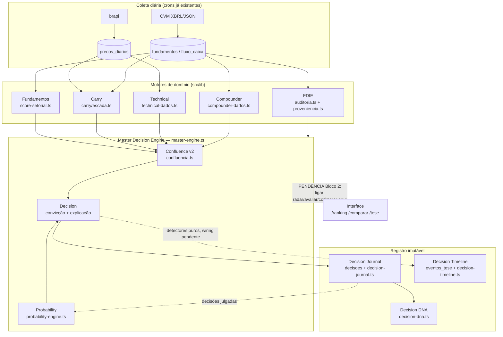
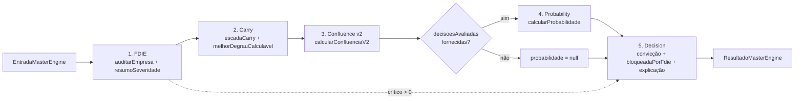
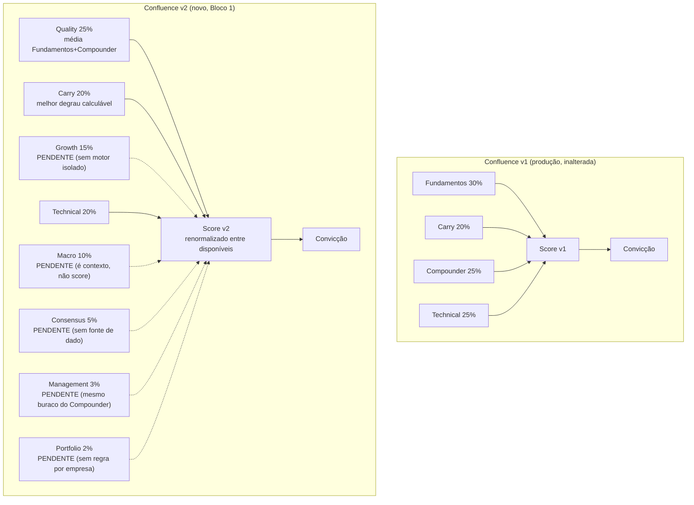
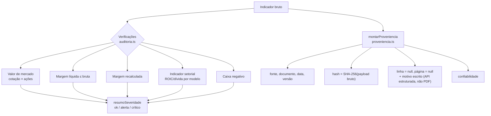

# FOUNDATION v3 — Bloco 1 (04/08/2026)

Sprint arquitetural, sem mudança de layout. Objetivo: transformar a infraestrutura lógica que sustenta o Encorpei nos próximos anos — Master Decision Engine, Confluence v2, Probability, FDIE v2, Decision Journal, Decision Timeline, Decision DNA, e uma primeira rodada de auditoria do Domain Layer.

Corte honesto aplicado o tempo todo: onde não existe motor real, o sistema retorna `null` com o motivo escrito ao lado — nunca um número inventado, nunca um "peso zero" disfarçado de silêncio.

## Arquitetura implementada

Todos os módulos abaixo são **funções puras** (sem Supabase, sem I/O) em `src/lib/`. A camada de busca de dados (`*-dados.ts`) continua separada, seguindo o padrão já usado por `confluencia-dados.ts` e `radar.ts` — este Bloco 1 não criou uma nova camada de fetch para os módulos novos porque o wiring de produção fica para o Bloco 2 (ver Pendências).

- **Master Decision Engine** (`master-engine.ts`) — orquestra FDIE → Carry → Confluence v2 → Probability → Decision.
- **Confluence v2** (`confluencia.ts`, funções `calcularConfluenciaV2`) — 8 componentes, convive com a v1 (não substitui).
- **Probability Engine** (`probability-engine.ts`) — probabilidade histórica + confiabilidade + base estatística, nunca só uma nota.
- **FDIE v2 / Proveniência** (`proveniencia.ts`) — fonte, documento, linha, página, data, versão, hash, timestamp, confiabilidade por indicador.
- **Decision Journal** (`decision-journal.ts`) — enriquece o `contexto` da tabela imutável `decisoes` (não cria tabela nova).
- **Decision Timeline** (`decision-timeline.ts` + migração `020`) — detectores puros de mudança, gravam em `eventos_tese` (não cria tabela nova).
- **Decision DNA** (`decision-dna.ts`) — agrega decisões julgadas por fator presente; nunca realimenta pesos.
- **Domain Layer** — `melhorDegrauCalculavel()` extraída para `carry/escada.ts`, eliminando duplicação com `avaliar/route.ts`.

## 1. Arquitetura implementada

Master Decision Engine (`master-engine.ts`) como orquestrador único dos motores que já têm dado real (FDIE, Carry, Fundamentos/Compounder via Confluence v2, Technical) mais Probability quando há histórico de decisões. Confluence v2 (`confluencia.ts`) com 8 componentes: Quality (Fundamentos+Compounder), Carry, Technical calculados de verdade hoje; Growth, Macro, Consensus, Management e Portfolio entram como pendência explícita (sem motor/fonte de dado ainda), nunca como número fabricado. Probability Engine (`probability-engine.ts`) reaproveita o julgamento já feito por `decision-history.ts` e classifica confiabilidade por número de observações (insuficiente/baixa/média/alta). FDIE v2 (`proveniencia.ts`) adiciona hash SHA-256 do payload bruto por indicador; linha/página ficam permanentemente `null` com motivo escrito (dado que a fonte estruturada da CVM não produz). Decision Journal e Decision Timeline reaproveitam as tabelas imutáveis já existentes (`decisoes`, `eventos_tese`) em vez de criar tabelas novas — decisão registrada explicitamente abaixo. Decision DNA agrega decisões por fator presente, com piso mínimo de observações antes de reportar taxa, e nunca realimenta pesos de nenhum motor.

## 2. Lista dos arquivos criados

- `src/lib/master-engine.ts` + `master-engine.test.ts`
- `src/lib/probability-engine.ts` + `probability-engine.test.ts`
- `src/lib/proveniencia.ts` + `proveniencia.test.ts`
- `src/lib/decision-journal.ts` + `decision-journal.test.ts`
- `src/lib/decision-timeline.ts` + `decision-timeline.test.ts`
- `src/lib/decision-dna.ts` + `decision-dna.test.ts`
- `supabase/migrations/020_decision_timeline_tipos.sql`
- `roadmap/foundation-v3.md` (este documento)

## 3. Lista dos arquivos alterados

- `src/lib/carry/escada.ts` — adicionada `melhorDegrauCalculavel()`.
- `src/lib/carry/carry.test.ts` — testes da função acima.
- `src/app/api/teses/avaliar/route.ts` — passou a importar e usar `melhorDegrauCalculavel()` em vez de duplicar a lógica inline (nenhuma mudança de comportamento).
- `src/lib/confluencia.ts` — exporta `CARRY_FAIXAS`; adiciona `calcularConfluenciaV2()`, `CONFLUENCIA_V2_PESOS`, tipos v2. A v1 não foi alterada.
- `src/lib/confluencia.test.ts` — testes do Confluence v2.

## 4. Fluxograma atualizado

## 5. Diagrama do Master Decision Engine

## 6. Diagrama do Confluence

## 7. Diagrama do FDIE

## 8. Testes criados

233 testes passam (`npm run test`), 25 arquivos. Novos/ampliados neste Bloco:

- `carry.test.ts` — +3 testes de `melhorDegrauCalculavel` (Floor vence sem DFC, Cash vence com DFC, fallback não quebra).
- `confluencia.test.ts` — +6 testes de `calcularConfluenciaV2` (pesos somam 100%, pendências corretas, Quality combina/degrada, score null sem dado, v1 intacta).
- `probability-engine.test.ts` — 6 testes (sem decisões, só neutro/indisponível, limiares de confiabilidade, denominador correto, explicação sem promessa).
- `proveniencia.test.ts` — 5 testes (linha/página sempre null, hash determinístico, hash muda com payload, timestamp injetado, payload ausente não quebra).
- `decision-journal.test.ts` — 2 testes (foto completa, tudo null sem quebrar).
- `decision-timeline.test.ts` — 12 testes (todos os 5 detectores + limiares).
- `decision-dna.test.ts` — 7 testes (agregação, piso mínimo de observações, separação por valor, múltiplos fatores, nunca promete/altera pesos).
- `master-engine.test.ts` — 6 testes (fluxo completo, bloqueio por FDIE crítico, melhor degrau do Carry propaga, tudo vazio não quebra, probability entra quando fornecida, trava de linguagem).

`npm run build` passou limpo (TypeScript + ESLint do Next.js), sem alterar nenhuma página/layout.

## 9. Pendências

1. **Migração dos 3 call sites de produção para o Master Engine** (`radar.ts`, `/api/teses/avaliar`, `/comparar`) — a especificação pede que "nenhuma nota seja calculada fora deste fluxo". Hoje eles continuam calculando nota do jeito antigo; o Master Engine existe e funciona, mas não está religado à interface. Decisão minha, registrada aqui: não tocar essas rotas de produção uma terceira vez no mesmo dia sem sua ratificação — proponho isso como item 1 do Bloco 2.
2. **Wiring dos detectores da Decision Timeline** — `decision-timeline.ts` está pronto e testado, mas nenhuma rota chama os detectores nem grava em `eventos_tese` ainda. Precisa decidir onde entra (dentro de `/api/teses/avaliar`, no ciclo diário) — outro ponto de tocar a mesma rota sensível, por isso ficou de fora deste Bloco.
3. **Enriquecimento do `contexto` ao registrar decisão** — `decision-journal.ts` monta a foto completa (`montarContextoDecisao`), mas `/diario` ainda grava o `contexto` no formato antigo. Trocar é mudança pequena e segura, mas também fica para o Bloco 2 para não acumular mudanças de produção no mesmo dia.
4. **Growth, Macro, Consensus, Management, Portfolio isolados** — sem motor nem fonte de dado hoje. Entram no Confluence v2 como pendência explícita. Construir cada um é trabalho de descoberta de fonte de dado, não de encanamento — não dá para estimar prazo sem antes decidir fonte (ex.: Macro poderia vir do Focus/Selic já coletado, mas como score comparável por empresa é um desenho novo).
5. **Migração 020 ainda não aplicada no banco** — só está no repositório (`supabase/migrations/020_decision_timeline_tipos.sql`). Precisa rodar no Supabase antes de qualquer gravação de `tipo = 'mudanca_nota'` etc. funcionar (sem isso, o `check constraint` rejeita o INSERT).
6. **Probability Engine hoje reporta quase sempre "insuficiente"** — não é bug, é reflexo de haver pouquíssimas decisões no Diário. Vai ficar honesto (e pouco útil na prática) até o Diário acumular histórico real.

## 10. Riscos técnicos

- **Divergência entre v1 e v2 do Confluence em produção** — enquanto a interface usa v1 e o Master Engine (não ligado ainda) usa v2, os dois números vão divergir se alguém comparar. Mitigado por documentação clara (este arquivo) e pelos comentários no próprio `confluencia.ts`; risco real só aparece quando o Bloco 2 ligar o Master Engine à interface.
- **Migração 020 pendente de aplicação** — se algum código tentar gravar os novos tipos de evento antes de rodar a migração no Supabase, o INSERT falha por violar o `check constraint`. Nenhum código deste Bloco tenta gravar ainda (wiring é pendência), então o risco é zero hoje, mas vira armadilha se o Bloco 2 esquecer de aplicar a migração antes de ligar o wiring.
- **Pesos do Confluence v2 são provisórios** — 8 componentes com pesos escolhidos por julgamento (não calibrados por dado histórico), documentado no próprio código. Como 5 dos 8 ficam pendentes hoje, o efeito prático é pequeno agora, mas os pesos vão precisar de revisão quando Growth/Macro/Consensus/Management/Portfolio ganharem motor real.
- **`melhorDegrauCalculavel` extraída sem mudar comportamento** — risco baixo (mesma lógica, só movida de lugar), mas é a terceira vez que `avaliar/route.ts` é tocado hoje; testado via `npm run build` + suíte completa, sem mudança de output esperada.

## 11. Sugestões para o Bloco 2

1. Ratificar (ou não) a migração dos 3 call sites para o Master Engine — é a peça que faltou para "nenhuma nota fora do fluxo" ser verdade de fato, não só arquitetura pronta e desligada.
2. Aplicar a migração `020` no Supabase (mesmo método já usado: SQL Editor via Chrome) e então ligar os detectores da Decision Timeline dentro do ciclo diário.
3. Trocar o `contexto` gravado por `/diario` para usar `montarContextoDecisao()` — mudança pequena, mas só depois de decidir de onde vêm Confluence v2/FDIE no momento do registro (hoje `/diario` não tem esses dados carregados).
4. Escolher, um de cada vez, qual dos 5 componentes pendentes do Confluence v2 ganha motor primeiro — Macro é o mais barato (já há Focus/Selic/CDI/IPCA coletado; falta só desenhar como virar score comparável por empresa).
5. Recalibrar `CONFLUENCIA_V2_PESOS` com base em dado real assim que 2-3 dos componentes pendentes destravarem — pesos de hoje são julgamento, não calibração.
6. Deixar o Probability Engine "aquecendo" — nenhuma ação necessária além de continuar registrando decisões no Diário; o número fica mais útil sozinho com o tempo.
