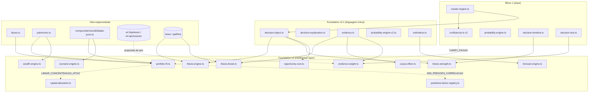
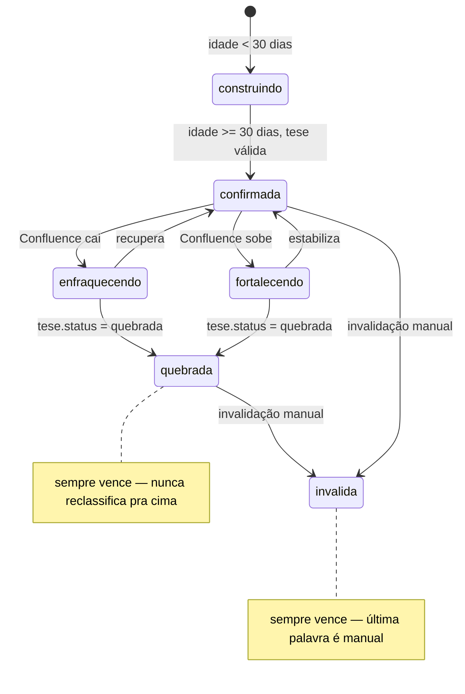
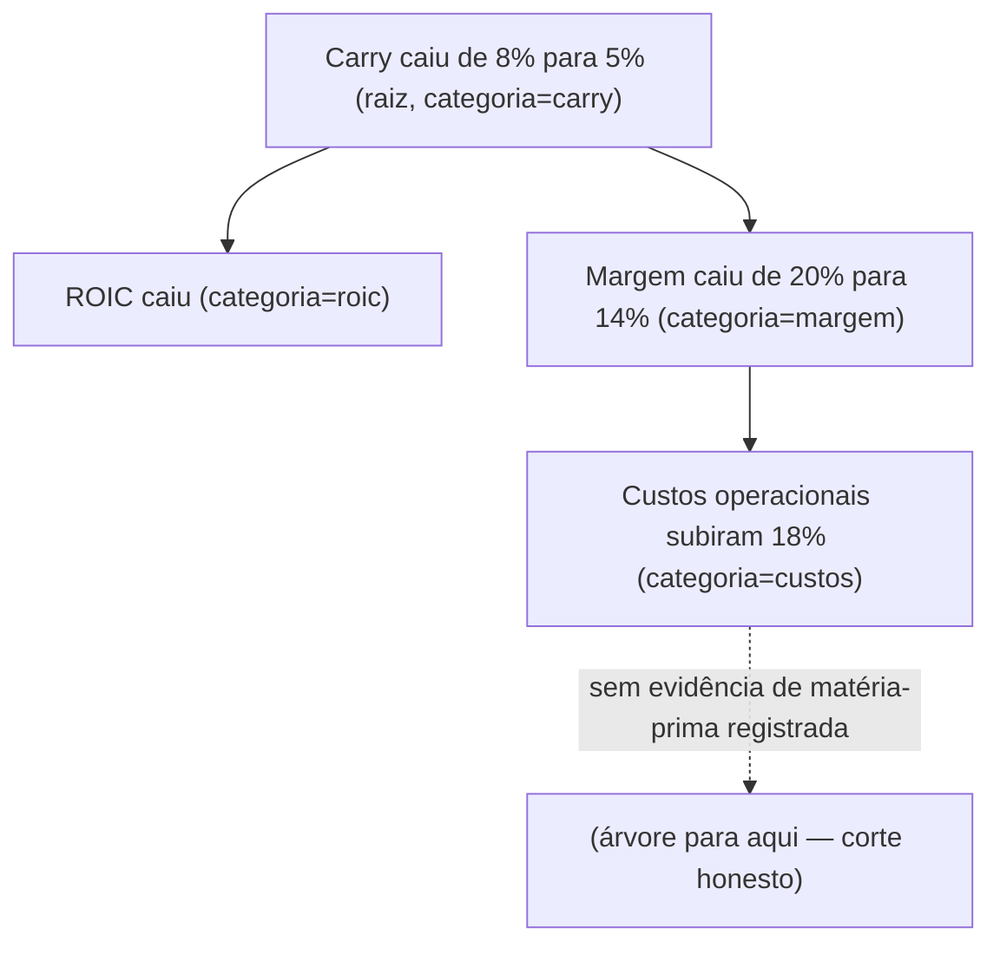
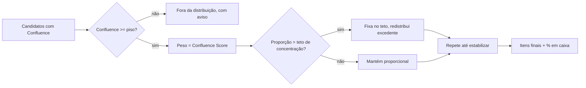
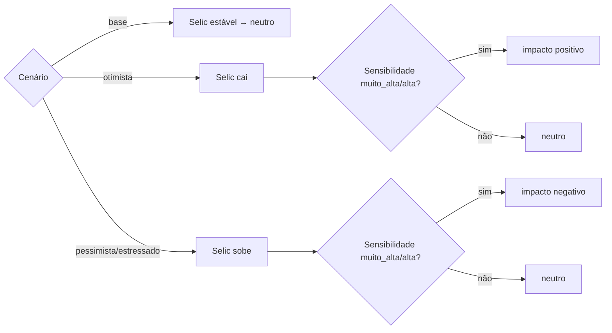

# ENCORPEI INVEST — FOUNDATION V4 — INTELLIGENCE LAYER

Terceiro e último sprint de fundação da arquitetura do domínio (depois de
Bloco 1 e Foundation v3.1). Sem mudança visual/de layout — puramente
arquitetura, 15 módulos, camada de "inteligência" sobre o que já existia:
Thesis Engine, Cause & Effect, Thesis Break, Thesis Strength, Portfolio
Fit, Capital Allocation, Opportunity Cost, Wealth Engine, Forecast Engine,
Scenario Engine, Evidence Weight, Predictive Factor Registry, Auditoria de
Domínio Unificada, Testes, Documentação.

## 1. Arquitetura atualizada

Nenhuma seta é circular — todo módulo v4 aponta para trás (Bloco 1, v3.1,
ou outro módulo v4 já existente), nunca para frente. Essa é a checagem
central do Módulo 13 (auditoria de domínio), detalhada na seção 8.

## 2. Lista de arquivos criados

**Domínio (12 motores + 12 arquivos de teste):**

| Arquivo | Módulo | Responsabilidade |
|---|---|---|
| `src/lib/thesis-engine.ts` | 1 | `PerfilTese`, `StatusDerivadoTese` (6 estados), estrutura de tese (premissas/evidências/riscos/catalisadores) |
| `src/lib/thesis-break.ts` | 3 | Identifica quais gatilhos QUEBRARIAM a tese, reaproveitando `gatilhos` |
| `src/lib/cause-effect.ts` | 2 | Árvore causal de plausibilidade (Carry→ROIC→Margem→Receita/Custos) |
| `src/lib/thesis-strength.ts` | 4 | Strength Delta — direção da força da tese, reaproveitando `detectarMudancaConfluence` |
| `src/lib/portfolio-fit.ts` | 5 | 7 componentes de encaixe na carteira (concentração/setor/correlação/macro/carry/growth/liquidez) |
| `src/lib/capital-allocation.ts` | 6 | Calculadora determinística de distribuição de capital, com teto de concentração |
| `src/lib/opportunity-cost.ts` | 7 | Registra gap de Confluence/Carry entre o escolhido e alternativas consideradas |
| `src/lib/wealth-engine.ts` | 8 | CAGR anualizado, retorno real acima do IPCA, tempo estimado até a meta |
| `src/lib/forecast-engine.ts` | 9 | Projeção por extrapolação trailing (1 período à frente), nunca estimativa de analista |
| `src/lib/scenario-engine.ts` | 10 | 4 cenários macro, impacto quantificado só no canal de Selic |
| `src/lib/evidence-weight.ts` | 11 | Resolve peso de evidência só a partir de aprovação manual no ERL |
| `src/lib/predictive-factor-registry.ts` | 12 | Catálogo estático de todo fator preditivo do sistema |

Cada um tem um `*.test.ts` homônimo (12 arquivos de teste novos).

**Migração:**

- `supabase/migrations/022_tese_estrutura.sql` — tabela `tese_estrutura`
  (premissas/evidências/riscos/catalisadores/fatores negativos/objetivos/
  hipóteses por tese, versionada, INSERT-only). **Ainda não aplicada no
  Supabase** — só está no repositório (mesma situação da migração 021 em
  v3.1 até este momento).

## 3. Lista de arquivos alterados

- `src/lib/evidence.ts` — adicionada a categoria `"custos"` ao union
  `EvidenciaCategoria` (mudança aditiva, sem quebrar nada que já usava o
  tipo) para dar profundidade ao exemplo Carry→Margem→Custos do Cause &
  Effect Engine.
- `src/lib/faixas.ts` — extraída `mediaPonderadaRenormalizada()`
  (deduplicação do cálculo que `confluencia.ts` já fazia duas vezes
  inline). Confluence v1/v2 **não** foram retrofitados para usar a nova
  função — decisão deliberada de não mudar comportamento já em produção.
- `src/lib/cause-effect.ts` — corrigido durante o Módulo 14 (testes):
  `"carry"` não é uma `EvidenciaCategoria` válida (Carry é métrica
  calculada, não evidência coletável). Introduzido o tipo `CategoriaCausal
  = EvidenciaCategoria | "carry"` para a raiz da árvore e para as chaves do
  mapa causal, mantendo `Evidencia.categoria` intocado (só as 13 categorias
  reais). Sem esse ajuste `npm run build` falhava no type-check — corrigido
  antes da entrega, não depois.
- `src/lib/cause-effect.test.ts` — ajustado o teste de prevenção de ciclo
  para usar duas categorias de evidência reais (`roic`↔`margem`) em vez de
  marcar uma evidência com categoria `"carry"` (inválida); adicionado teste
  para raiz sem categoria (`null`).

## 4. Diagramas dos novos motores

### Thesis Engine — `StatusDerivadoTese`

### Cause & Effect Engine — árvore de plausibilidade

### Capital Allocation Engine — waterfall de concentração

### Scenario Engine — impacto por cenário (canal Selic)

## 5. Testes criados

113 testes novos (383 no total do domínio, todos passando):

- `thesis-engine.test.ts`, `thesis-break.test.ts`, `thesis-strength.test.ts`, `cause-effect.test.ts`, `portfolio-fit.test.ts` — cobrem classificação de status, prevenção de ciclo/profundidade máxima, watchlist sem coletor, Strength Delta, e os 7 componentes de Portfolio Fit (incluindo correlação de Pearson e cortes honestos de null).
- `capital-allocation.test.ts` — vazio→caixa, piso de Confluence, distribuição proporcional, teto de concentração com redistribuição, trava de linguagem.
- `opportunity-cost.test.ts` — sem alternativas, auto-remoção da escolhida, gaps de Confluence/Carry (incluindo os dois lados null, testados com fixtures determinísticas), melhor alternativa factual.
- `wealth-engine.test.ts` — gate de pregões mínimos, anualização de CAGR e do retorno real vs. IPCA, probabilidade sempre null (nunca fabricada), tempo estimado via juros compostos e seus 4 casos de corte honesto.
- `forecast-engine.test.ts` — série curta, extrapolação com crescimento constante, descarte de variações com valor anterior zero/negativo, janela customizada, confiabilidade por tamanho de amostra.
- `scenario-engine.test.ts` — 4 cenários × mapeamento de sensibilidade→impacto, IPCA/PIB/Dólar/Commodities sempre null, agregação de carteira.
- `evidence-weight.test.ts` — proposta pendente/rejeitada/sem identificação nunca altera peso, desempate por data e por id, agregação observacional via `resumirFatores`.
- `predictive-factor-registry.test.ts` — unicidade de id, nenhum campo vazio, contagem por status.

## 6. Cobertura

Medida com `@vitest/coverage-v8` sobre os 12 arquivos de domínio do
Foundation v4:

| Arquivo | Statements | Branches | Functions | Lines |
|---|---|---|---|---|
| cause-effect.ts | 100% | 100% | 100% | 100% |
| predictive-factor-registry.ts | 100% | 100% | 100% | 100% |
| scenario-engine.ts | 100% | 100% | 100% | 100% |
| thesis-break.ts | 100% | 100% | 100% | 100% |
| thesis-engine.ts | 100% | 100% | 100% | 100% |
| capital-allocation.ts | 100% | 95,23% | 100% | 100% |
| evidence-weight.ts | 100% | 96,42% | 100% | 100% |
| opportunity-cost.ts | 100% | 93,75% | 100% | 100% |
| thesis-strength.ts | 100% | 90% | 100% | 100% |
| forecast-engine.ts | 96,96% | 89,47% | 100% | 100% |
| wealth-engine.ts | 100% | 88,46% | 100% | 100% |
| portfolio-fit.ts | 98,82% | 82,75% | 94,44% | 100% |

Todos os 12 arquivos em 100% de lines; statements sempre acima de 96,9%.
O ponto mais baixo é branch coverage de `portfolio-fit.ts` (82,75%) —
reflete ternários de explicação textual (ex.: "setor informado" vs. "setor
null") onde só um dos dois lados foi exercitado pelos testes; mesmo padrão
já aceito em v3.1 (`probability-engine-v2.ts` ficou em 72% de branches,
documentado como ramo defensivo de baixo valor marginal). `npm run build`
limpo, `npm run test` com 383/383 passando, nenhuma página alterada.

## 7. Pendências restantes

1. Migração `022` (`tese_estrutura`) ainda não aplicada no Supabase — só está no repositório.
2. Nenhum dos 12 motores novos foi ligado a rota/tela — mesma restrição explícita de "sem mudança visual" já seguida em Bloco 1 e v3.1.
3. `Evidence Weight Engine` está pronto para ler `erl.hipoteses`/`erl.aprovacoes`, mas nada no código hoje faz essa leitura de banco — os testes usam `PropostaPesoEvidencia` construída à mão; falta o adaptador que consulta o Supabase e monta essa lista.
4. `Predictive Factor Registry` cataloga 15 fatores mas não cobre 100% do que existe no sistema (ex.: Score Setorial v2, Management Intelligence, FDIE em si não têm entrada própria) — cobre os fatores centrais de Confluence/Carry/Probability/Portfolio Fit/Sensibilidade Juros; expandir é trabalho de manutenção contínua, não bloqueante.
5. `confluence_macro`/`confluence_management` (registry) documentam que Macro Engine v0 e Management Intelligence v0 já coletam dado bruto mas não estão fiados ao componente correspondente do Confluence — pendência de fiação herdada de sprints anteriores, não nova.
6. `Capital Allocation Engine` e `Opportunity Cost Engine` seguem a mesma restrição do resto do domínio: ninguém os chama ainda — prontos para o Bloco 2.

## 8. Limitações

- **Scenario Engine**: só o canal Selic tem impacto quantificado; IPCA/PIB/Dólar/Commodities ficam sempre `null` com motivo — não existe modelo de sensibilidade calibrado pra eles.
- **Wealth Engine**: `probabilidadeAtingirObjetivo` é sempre `null` por decisão deliberada — geraria uma projeção estatística fabricada sem um motor de simulação estocástica por trás (pendência explícita para o Research Lab).
- **Forecast Engine**: projeta só 1 período à frente; nunca compõe a taxa estimada por múltiplos períodos (amplificaria incerteza sem dado novo).
- **Evidence Weight Engine**: peso só muda com aprovação manual identificada (`aprovado=true` + `aprovado_por` preenchido) em `erl.aprovacoes` — sem isso, peso fica sempre no padrão neutro (1), para sempre, por design.
- **Portfolio Fit / Sensibilidade Juros**: heurística declarada, nunca calibrada contra histórico real de preço vs. Selic (mesma limitação já documentada em `compounder/sensibilidade-juros.ts` desde antes deste sprint).
- **Predictive Factor Registry**: registro estático em código — se fatores passarem a ser definidos dinamicamente no futuro, precisa migrar para tabela.

## 9. Riscos técnicos

- **Módulo 6 (Capital Allocation)**: a especificação original pediu literalmente uma distribuição percentual ("35% Empresa A..."), o que esbarra na regra 7 do CLAUDE.md (proibido "compre"/"venda"/"recomendamos"). Mitigado construindo como calculadora mecânica versionada, nunca como conselho — mas é a função com a linguagem mais perto da linha, vale revisão humana antes de qualquer tela consumir.
- **`CategoriaCausal` (novo tipo em cause-effect.ts)**: introduzido a meio do sprint para corrigir um erro de type-check que só apareceu no `npm run build` (vitest não faz checagem de tipo completa) — reforça que checar só `npm run test` durante o desenvolvimento não é suficiente; `npm run build` precisa rodar antes de qualquer entrega, não só no final.
- **Registry (Módulo 12) e Wealth Engine dependem de dados que hoje não existem em nenhuma tela** (patrimônio objetivo, aprovações do ERL) — ficam sem uso real até o Bloco 2 wire-up; risco baixo (são só funções puras esperando input), mas vale registrar que "pronto" aqui significa "testado com dado sintético", não "validado com dado real do Carlos".
- **9 dos 15 componentes de Confluence continuam null** (5 antigos de v3.1 + agora growth/macro/consensus/management/portfolio também aparecem como "experimental" no Predictive Factor Registry) — o registry deixa isso mais visível do que estava antes, o que é intencional, mas pode surpreender quem olhar o registry pela primeira vez sem o contexto acumulado dos 3 sprints.

## 10. Avaliação da prontidão do Foundation para iniciar o Bloco 2

**Pronto, com ressalvas.** Os 15 módulos pedidos foram entregues, testados
(383/383 passando) e buildam limpo. A disciplina de "não duplicar motor"
foi seguida em todos os 12 arquivos novos — cada um reaproveita pelo menos
uma peça de infraestrutura já existente (Decision Object, `teses`/
`gatilhos`, `detectarMudancaConfluence`, `mediaPonderadaRenormalizada`,
`LIMIAR_CONCENTRACAO_ATIVO`, `sensibilidadeJuros`, `erl.hipoteses`/
`erl.aprovacoes`, `resumirFatores`), e a auditoria de domínio (Módulo 13,
seção 1 deste documento) não encontrou dependência circular nem dois
motores resolvendo o mesmo problema.

A ressalva real: **nada disso foi ligado a uma tela ou rota ainda** — os
três sprints de Foundation inteiros (Bloco 1 + v3.1 + v4, ~35 arquivos de
domínio) existem hoje só como funções puras testadas, nunca chamadas em
produção. Isso foi restrição explícita de cada spec ("sem mudança
visual"), mas significa que o Bloco 2 não é só "construir sobre uma base
sólida" — é a primeira vez que qualquer um desses motores vai encostar em
dado real do Carlos em produção, o que pode revelar formatos de dado
inesperados que o teste sintético não capturou. Recomendação: o Bloco 2
deveria começar ligando 1-2 motores de baixo risco (ex.: Decision Object
numa tela de leitura) antes de expor os de maior risco de linguagem
(Capital Allocation) ou os que dependem de dado ainda não coletado
(Evidence Weight via ERL).
